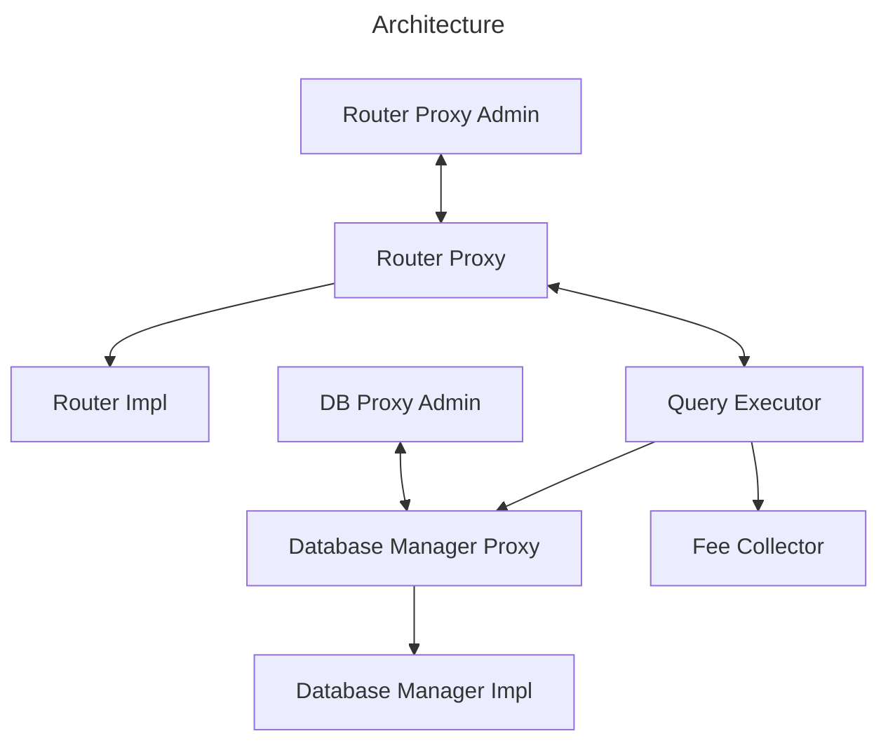

# Architecture

For every chain, we deploy a total of 8 contracts to power the coprocessor:

1. `RouterProxy` - The main, immutable entrypoint for the system. Clients send requests and receive responses from this contract.
1. `Router` - The implementation contract for the `RouterProxy`.
1. `RouterProxyAdmin` - The admin contract for the `RouterProxy`.
1. `DatabaseManager` - The contract that reflects the state of the database that the LPN is indexing offchain. This is where new queries are registered.
1. `DatabaseManagerProxy` - The proxy contract for the `DatabaseManager`.
1. `DatabaseManagerProxyAdmin` - The admin contract for the `DatabaseManagerProxy`.
1. `QueryExecutor` - The contract that validates query requests and groth16 response proofs.
1. `FeeCollector` - A generic, central contract for collecting fees.

