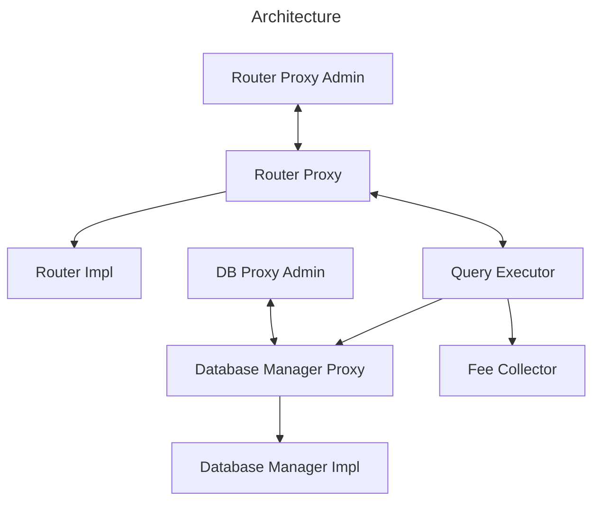
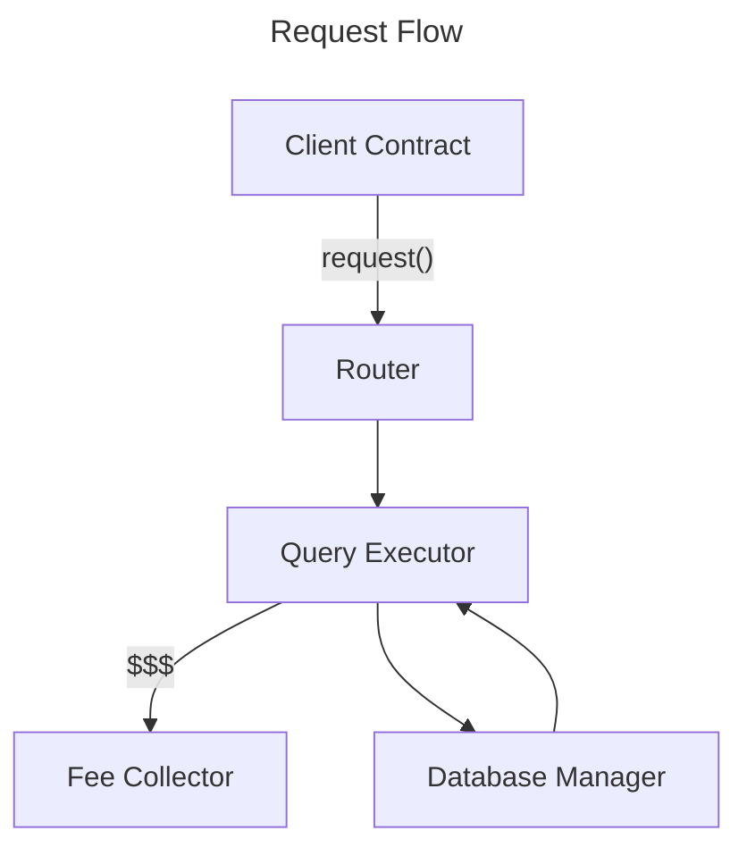
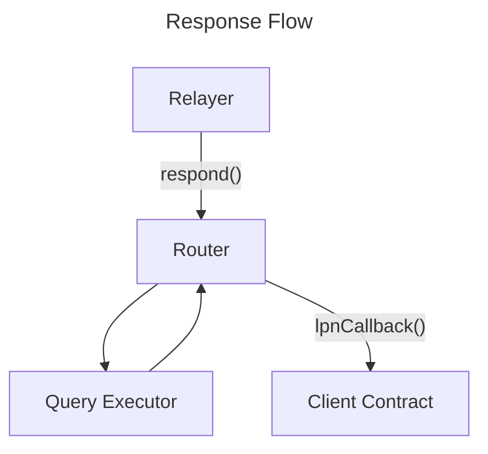

# Lagrange ZK Coprocessor On-Chain System Overview

_The Lagrange ZK Prover Network_ (LPN) is a decentralized network for proof generation. Built on top of the LPN is the _Lagrange ZK Coprocessor_, a system that enables smart contracts to query historical blockchain data with zero-knowledge proofs for verification of data integrity.

## Features & Use Cases

The LPN ZK-Coprocessor enables several distinct features:

1. **Historical Data Analysis**: Query and analyze historical blockchain data directly from a smart contract
2. **Data Verification**: Verify query results cryptographically using zero-knowledge proofs
3. **Cross-Chain Data Access**: Access, query, and aggregate data across multiple blockchains
4. **Efficient Indexing**: Get indexed data without building and maintaining custom indexers
5. **Trustlessness**: The verifiability of query data means the system is as trustless as the blockchain itself

Some common ideas include:

- A DeFi protocol that wants to reward users based on historical engagement
- A DeFi protocol that wants to calculate a TWAP (Time-Weighted Average Price) for a token
- A governance protocol that wants to assess historical participation of a user
- An NFT project that wants to analyze historical ownership of a particular token

## Fees

The fee structure consists of three components:

1. **Gas Fee**: The fee the user pays for the fulfilment transaction. This fee covers the gas for verifying the proof and executing the user's callback.
3. **Query Fee**: A variable fee that is based on the query length and complexity. In the first version of the protocol, this fee is constant for all queries but may change in the future. These fees pay for the prover's work.
4. **Protocol Fees**: Optional fixed and percentage-based protocol fees

All fees are collected by the `FeeCollector` contract and can be withdrawn by authorized parties.

## Modularity & Upgradability

The system is designed with modularity and upgradability in mind:

1. **Proxy Pattern**: Some contracts that are not expected to change often use the transparent proxy pattern (`LagrangeQueryRouter` and `DatabaseManager`). We use a proxy pattern for the router becasue we want the entrypoint to be immutable for clients. We use a proxy pattern for the database manager because it hold a lot of state that we don't want to migrate to a new contracts if changes are needed. The router is meant to be an incredibly basic pass-through contract that forwards requests to the `QueryExecutor`.

2. **Component Separation**: Each major function has its own contract. This allows for individual component upgrades.
   - Whenever zk circuits are updated, we deploy a new `QueryExecutor` and swap out the old one.
   - The `FeeCollector` is an incredibly basic contract that just holds all the fees and allows for them to be withdrawn. This keeps the financial logic away from the complexity of the other contracts.
   - The only contract we expect to never change is the `RouterPoxy`. This address we want to remain immutable.

## Architecture

For every chain, we deploy a total of 8 contracts:

1. `RouterProxy` - The main, immutable entrypoint for the system. Clients send requests and receive responses from this contract.
1. `Router` - The implementation contract for the `RouterProxy`.
1. `RouterProxyAdmin` - The admin contract for the `RouterProxy`.
1. `DatabaseManager` - The contract that reflects the state of the database that the LPN is indexing offchain. This is where new queries are registered.
1. `DatabaseManagerProxy` - The proxy contract for the `DatabaseManager`.
1. `DatabaseManagerProxyAdmin` - The admin contract for the `DatabaseManagerProxy`.
1. `QueryExecutor` - The contract that validates query requests and groth16 response proofs.
1. `FeeCollector` - A generic, central contract for collecting fees.

## Request Flow

1. A client sends a request to the `LagrangeQueryRouter`
2. The `LagrangeQueryRouter` forwards the request to the default `QueryExecutor`
3. The `QueryExecutor` does the following:
   * Validates the request
   * Confirms with the `DatabaseManager` that the query and table are active
   * Confirms the fee paid is sufficient
   * Forwards the fee to the `FeeCollector`

## Response Flow

1. The Lagrange Relayer (offchain component) sends a response to the `LagrangeQueryRouter`
2. The `LagrangeQueryRouter` forwards the response to the same `QueryExecutor` that the original request was sent to
3. The `QueryExecutor` does the following:
   * Validates the Groth16 proof
   * Returns back to the `LagrangeQueryRouter`
4. The `LagrangeQueryRouter` calls the client contract with the response data

