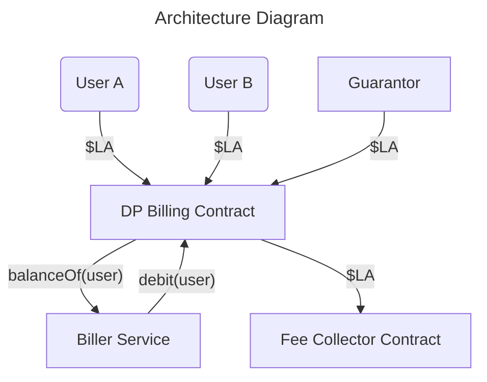

# DeepProvePayments Contract

## Overview

The `DeepProvePayments` contract manages payment processing for DeepProve services using LA tokens. The contract supports two payment methods: **escrow agreements** and **a la carte payments**. Access is restricted - users must be explicitly whitelisted by the contract owner to participate. The contract enables a designated biller to charge users for services, with all collected funds automatically transferred to a fee collector contract.

### Payment Methods

1. **Escrow Agreements**: Users deposit LA tokens upfront and receive periodic rebate payments over a specified duration
2. **A La Carte**: Users maintain a balance that can be charged directly for services without rebates

### Key Roles

- **Owner**: Creates escrow agreements and manages user whitelist
- **Biller**: Authorized to charge users for services
- **Users**: Must be whitelisted to use services
- **Fee Collector**: Receives all charged funds from users
- **Guarantor**: Maintains a reserve of LA tokens if needed for rebate payments



## Requirements

### Core Functionality
- **User Whitelisting**: Users must be explicitly whitelisted by the owner to use any services
- **Dual Payment Methods**: Supports both escrow agreements with rebates and a la carte payments
- **Billing System**: Designated biller can charge users for services consumed
- **Fee Collection**: All charged funds are automatically transferred to the fee collector
- **Escrow Agreements**: Owner can create pre-established agreements for specific users
- **Token Deposits**: Users deposit LA tokens to activate escrow agreements or top up a la carte balances
- **Periodic Rebates**: Users with escrow agreements receive rebate payments over time
- **Guarantor Integration**: Contract can pull additional funds from guarantor for rebate payments

### Key Features
- **Access Control**: Only whitelisted users can use services; only owner manages whitelist
- **Flexible Charging**: Biller charges against escrow balance first, then a la carte balance
- **Owner-Controlled Setup**: Only contract owner can create and cancel agreements
- **User-Controlled Activation**: Users activate agreements by depositing required LA tokens
- **Time-Based Rebates**: Rebates are distributed over a specified number of days for escrow agreements
- **Top-Up Functionality**: Anyone can top up a whitelisted user's a la carte balance
- **Automatic Calculations**: Contract calculates available rebates based on time elapsed

## Lifecycle

### 1. Agreement Creation

**Function**: `createAgreement(address user, uint256 depositAmount, uint256 rebateAmount, uint16 rebateDurationDays, uint8 numRebates)`

1. Contract owner creates an escrow agreement for a specific user
2. Contract validates:
   - User address is not zero
   - Deposit amount > 0 and divisible by 10^9 (for gwei storage)
   - Rebate amount > 0 and divisible by 10^9 (for gwei storage)
   - Duration days > 0
   - Number of rebates > 0
   - No existing activated agreement for the user
3. New agreement is stored with:
   - `depositAmountGwei`: LA tokens user must deposit (max 72M LA)
   - `rebateAmountGwei`: LA tokens per rebate claim (max 281K LA)
   - `rebateDurationDays`: Total duration for rebate period
   - `numRebates`: Total number of rebates available
   - `activationDate`: Set to 0 (inactive)
   - `balance`: Set to 0 (until activation)
4. User is automatically whitelisted
5. Event `NewAgreement` is emitted

**Parameters**:
- `user`: Address to create the agreement for
- `depositAmount`: Amount of LA tokens to deposit (in wei, must be divisible by 10^9)
- `rebateAmount`: Amount per rebate claim (in wei, must be divisible by 10^9)
- `rebateDurationDays`: Rebate period duration in days
- `numRebates`: Total rebates available (max 255)

### 2. Agreement Activation

**Function**: `activateAgreement()`

1. User with pre-established agreement calls activation
2. Contract validates:
   - Agreement exists for caller
   - Agreement not already activated
   - User has approved sufficient LA tokens
3. Agreement is updated:
   - `activationDate` set to current timestamp
   - `balance` set to deposit amount (available for charging)
4. User is whitelisted (if not already)
5. LA tokens are transferred from user to contract
6. Event `AgreementActivated` is emitted

**Requirements**:
- User must approve contract to spend `depositAmount` of LA tokens  
- Can only be called once per agreement
- User must have sufficient LA token balance

### 3. Rebate Claiming

**Function**: `claimRebates()`

1. User calls `claimRebates()` to collect available rebates
2. Contract calculates claimable rebates based on:
   - Time elapsed since activation
   - Number of rebates already claimed
   - Whether agreement period has ended
3. For final claim (after duration ends):
   - All remaining rebates are claimable
   - Agreement is deleted from storage
4. For regular claims:
   - Rebates based on time proportion are claimable
   - Agreement remains active with updated claim count
5. If contract balance is insufficient, pulls additional funds from guarantor
6. Transfers total claimable amount to user
7. Event `RebateClaimed` is emitted

**Rebate Calculation**:
```
timeElapsed = currentTime - activationDate
rebatesPassed = (timeElapsed * numRebates) / totalDurationSeconds
claimableRebates = rebatesPassed - numRebatesClaimed
totalClaimable = claimableRebates * rebateAmount
```

### 4. Service Charging

**Function**: `charge(address user, uint88 amount)`

The biller can charge users for services consumed. This function implements a prioritized charging system:

1. **Authorization Check**: Only the designated biller can call this function
2. **Balance Validation**: Ensures user has sufficient combined balance (escrow + a la carte)
3. **Charging Priority**:
   - Charges against escrow balance first
   - If escrow balance is insufficient, charges remaining amount from a la carte balance
4. **Fund Transfer**: Automatically transfers charged amount to the fee collector
5. **Event Emission**: Emits `Charged` event with user and amount

**Charging Logic**:
```
if (escrowBalance >= chargeAmount) {
    escrowBalance -= chargeAmount
} else {
    aLaCarteBalance -= (chargeAmount - escrowBalance)
    escrowBalance = 0
}
```

**Requirements**:
- Only callable by the biller address
- User must have sufficient total balance (escrow + a la carte)
- Amount must be greater than zero

### 5. A La Carte Top-Up

**Function**: `topUp(address user, uint88 amount)`

Allows anyone to add funds to a whitelisted user's a la carte balance:

1. **Validation**: Ensures recipient is whitelisted and amount > 0
2. **Token Transfer**: Transfers LA tokens from caller to contract
3. **Balance Update**: Increases user's a la carte balance
4. **Event Emission**: Emits `TopUp` event

**Requirements**:
- Recipient user must be whitelisted
- Caller must have sufficient LA token balance and approval
- Amount must be greater than zero

### 6. Agreement Management

**Function**: `cancelAgreement(address user)`

- Only callable by owner
- Cancels future rebate claims for specified user
- Deletes agreement from storage
- Does not refund deposited tokens

## User Management

**Function**: `setWhitelisted(address user, bool whitelisted)`

- Only callable by owner
- Controls user access to all contract services
- Users are automatically whitelisted when an escrow agreement is created
- Required for users to receive top-ups or use services

**Function**: `setBiller(address newBiller)`

- Only callable by owner
- Sets the address authorized to charge users
- Must not be zero address

## View Functions

### User Information
- `isWhitelisted(address user)`: Returns true if user is whitelisted
- `getBalance(address user)`: Returns total balance (escrow + a la carte)
- `getEscrowBalance(address user)`: Returns user's escrow balance
- `getALaCarteBalance(address user)`: Returns user's a la carte balance
- `getBiller()`: Returns the current biller address

### Agreement Information  
- `getEscrowAgreement(address user)`: Returns complete agreement details for a user
- `hasClaimableRebates(address user)`: Returns true if user has rebates available to claim
- `getCurrentClaimableAmount(address user)`: Returns amount currently available to claim
- `getNextRebateClaimDate(address user)`: Returns timestamp of next rebate availability

### Contract Information
- `VERSION`: Returns contract version ("1.0.0")
- `LA_TOKEN`: Returns address of the LA token contract
- `GUARANTOR`: Returns address of the guarantor
- `FEE_COLLECTOR`: Returns address of the fee collector

## Data Structures

### User
```solidity
struct User {
    bool isWhitelisted;                 // Whether the user is approved to use DeepProve
    uint88 aLaCarteBalance;            // Amount of LA tokens for a la carte charges
    EscrowAgreement escrowAgreement;   // The escrow agreement (if any)
}
```

### EscrowAgreement
```solidity
struct EscrowAgreement {
    uint56 depositAmountGwei;    // Amount deposited by user (max 72M LA)
    uint48 rebateAmountGwei;     // Amount per rebate (max 281K LA)
    uint88 balance;              // Current balance for charges (max 300M LA)
    uint16 rebateDurationDays;   // Total rebate period in days
    uint8 numRebates;            // Total rebates available
    uint8 numRebatesClaimed;     // Rebates already claimed
    uint32 activationDate;       // When agreement was activated
}
```

## Events

- `NewAgreement(address indexed user, EscrowAgreement agreement)`: Emitted when agreement is created
- `AgreementActivated(address indexed user)`: Emitted when user activates agreement
- `RebateClaimed(address indexed user, uint256 amount)`: Emitted when user claims rebates
- `Charged(address indexed user, uint256 amount)`: Emitted when user is charged by biller
- `TopUp(address indexed from, address indexed to, uint256 amount)`: Emitted when user's a la carte balance is topped up

## Error Conditions

- `AgreementAlreadyActivated()`: Attempting to activate already active agreement
- `InsufficientBalance()`: User doesn't have enough balance for charge
- `InvalidAgreement()`: Operating on non-existent or invalid agreement
- `InvalidAmount()`: Zero amount provided where positive amount required
- `InvalidConfig()`: Invalid configuration parameters
- `NoClaimableRebates()`: No rebates available to claim
- `OnlyBillerCanCharge()`: Non-biller address attempting to charge users
- `TransferFailed()`: Token transfer operation failed
- `UserNotWhitelisted()`: User not whitelisted for service access
- `ZeroAddress()`: Zero address provided where valid address required 
