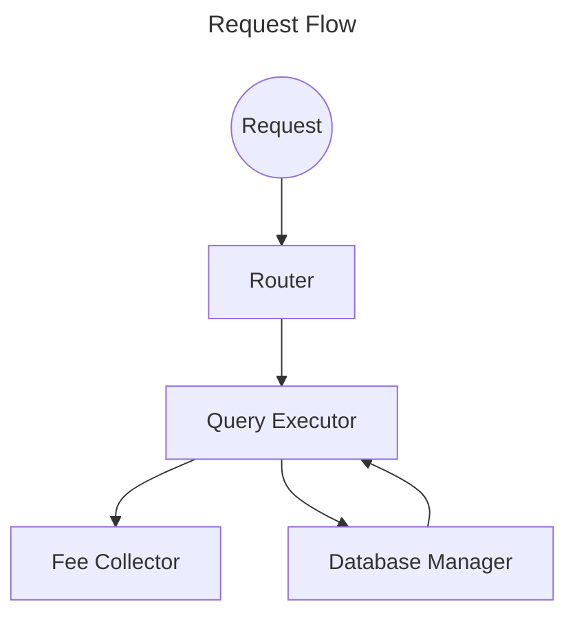

# Request Flow

1. A client sends a request to the `LagrangeQueryRouter`
2. The `LagrangeQueryRouter` forwards the request to the default `QueryExecutor`
3. The `QueryExecutor` does the following:
    * Validates the request
    * Confirms with the `DatabaseManager` that the query and table are active
    * Confirms the fee paid is sufficient
    * Forwards the fee to the `FeeCollector`

