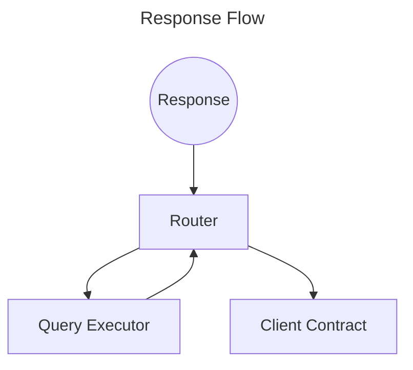

# Response Flow

1. The Lagrange Relayer (offchain component) sends a response to the `LagrangeQueryRouter`
2. The `LagrangeQueryRouter` forwards the request to the same `QueryExecutor` that the original request was sent to
3. The `QueryExecutor` does the following:
    * Validates the Groth16 proof
    * Returns back to the `LagrangeQueryRouter`
4. The `LagrangeQueryRouter` calls the client contract with the response data

